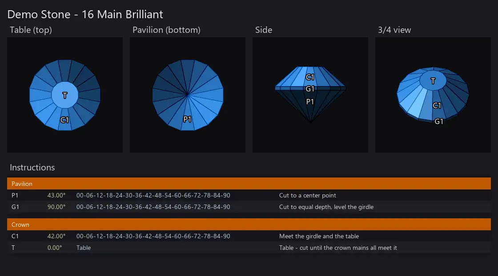

# GCS Viewer

[](https://github.com/loydb/GCSViewer/actions/workflows/tests.yml)
[](https://github.com/loydb/GCSViewer/releases/latest)

Look at a faceted gem design without opening the program that cut it.

**[⬇ Download GCSViewer.exe](https://github.com/loydb/GCSViewer/releases/latest/download/GCSViewer.exe)** —
Windows, nothing to install. Double-click a `.gcs` or `.gem` file and the
stone is on screen: three shaded views and the cutting instructions.

If you open designs all day, take the **folder build** from the
[releases page](https://github.com/loydb/GCSViewer/releases/latest) instead —
it starts in a third of the time (427 ms against 1,534 ms), because the single
file unpacks itself into `%TEMP%` on every launch.



*`docs/demo.gcs`, opened in the viewer. The third panel is live: drag to turn
the stone, arrow keys to tip it.*

## Why

Faceting design files are geometry, not pictures, so a folder of them is a
folder you cannot see — and finding one stone means opening candidates in a
design program one at a time. This makes them behave like photos: double-click
one, arrow through the folder, close it.

## About Gem Cut Studio

[**Gem Cut Studio**](https://gemcutstudio.com/), by **Rej Poirier**, is design
software for faceted gemstones — *"gem design, in real-time"*, in its own words.
You work in the terms a faceter actually cuts to — tiers, angles, index gear —
and see the finished stone rendered as you go, so a design can be judged on
screen before anything is ground against a lap. Its designs are the `.gcs`
files this viewer opens, and the tier / angle / index table under the renders
is the same vocabulary as its cutting-sequence panel.

GCS Viewer is an independent tool. It is not affiliated with Gem Cut Studio or
GemCad, it only reads their files, and it never modifies what it opens.

## What it shows

Three orthographic, flat-shaded panels, tinted with the material colour stored
in the file:

| Panel | View |
|---|---|
| **Table (top)** | straight down the optic axis |
| **Side** | the girdle profile |
| **3/4 view** | angled — drag to turn it, arrow keys to tip it |

Below them the **cutting sequence** — tier, angle, index list and the
instruction the file carries — grouped into Pavilion and Crown.

Angle, section and index list are derived from the geometry rather than read
from the file, so they appear even for designs that store no instructions.
Index positions come from each facet normal against the gear in the file (96 by
default): a normal at 22.5° on a 96 gear is index 06.

A panel with nothing facing it says so, which is not always a fault — a preform
has no crown yet, so there is genuinely nothing to draw from above.

Rendering is deliberately flat and matte: a painter's algorithm with back-face
culling, one fixed light and a specular highlight. No refraction, no
dispersion. Flat shading shows the facets, and a meet that does not meet stays
visible instead of disappearing into a sparkle.

## Formats

| | |
|---|---|
| **`.gcs`** | Gemcut Studio XML. Facets, tiers, instructions, material colour. |
| **`.gem`** | GemCad binary — **reverse-engineered**, no published spec. |

The `.gem` reader recovers the title and the designer's notes from a trailing
block of length-prefixed strings, and prints them along the foot of the sheet,
since that is often all a `.gem` says about itself. Face normals are recomputed
with Newell's method, because the stored ones cannot be relied on.

There is no `.asc` support, by design.

## Controls

| Key | Does |
|---|---|
| **← →** | previous / next design in the folder, wrapping, in Explorer's sort order |
| **drag** | turn the 3/4 view left and right |
| **↑ ↓** | tip the 3/4 view up and down |
| **I** | show / hide the instructions table |
| **G** | grayscale |
| **L** | tier labels |
| **S** | save the sheet as a PNG next to the design |
| **R** | reset the 3/4 angle |
| **Esc** / **Q** | close |

Files it cannot read are skipped while arrowing, rather than stopping the walk.

## Install

`GCSViewer.exe` needs nothing installed — no Python, no numpy, no Pillow.

1. Put it somewhere permanent, e.g. `C:\Tools\GCSViewer\`.
2. Register it, from that folder:

   ```powershell
   powershell -ExecutionPolicy Bypass -File .\Install-GcsViewer.ps1
   ```

That also gives `.gcs` and `.gem` files a gem icon instead of Explorer's blank
page, and adds a Start Menu entry which asks for a design when launched without
one.

## Make it the default

Windows lets only you set a default handler, not the program itself — the
setting is hash-protected so that applications cannot claim file types behind
your back.

Right-click a `.gcs` file → **Open with** → **Choose another app** → **GCS
Viewer** → **Always**, and repeat once on a `.gem` file. If **Always** is
greyed out, select the app first; if GCS Viewer is not listed, scroll to the
bottom for **Choose an app on your PC** and browse to `GCSViewer.exe`.

Gem Cut Studio stays available on both types through **Open with**.

If double-click shows the picker and choosing the viewer does nothing, re-run
`Install-GcsViewer.ps1` — versions 1.0.19 to 1.0.25 registered the file type
without a default action, and re-running repairs it.

To check the registration without opening dialogs:

```powershell
powershell -ExecutionPolicy Bypass -File .\scripts\Show-OpenWithList.ps1
```

It prints what Windows would offer for both extensions, whether a double-click
resolves to a program that exists, and any stale entries left behind by apps
that were moved or uninstalled.

If you move the install, re-run the installer from the new location. Any
default you explicitly set has to be picked again, because Windows ties a saved
choice to the app as it was registered when you chose it.

[`INSTALL.md`](INSTALL.md) is the version to hand to somebody else.

## Run from source

```bash
pip install -r requirements.txt
```

```bash
pythonw gcs_viewer.py "stone.gcs"              # the window
python  gcs_viewer.py "stone.gcs" --save       # write stone_views.png
python  gcs_viewer.py "stone.gcs" --save out.png --gray --no-labels
python  gcs_viewer.py --selftest report.txt    # prove a build works
python  gcs_viewer.py --version                # which build is this
```

numpy, Pillow and tkinter, and nothing else. Developed on Python 3.12; CI runs
the suite on 3.10, 3.12 and 3.13, on Windows and Linux.

Set `GCS_VIEWER_NO_GUI=1` to make errors print to stderr instead of opening a
message box, so an unattended script cannot stall on a dialog.

## Build the exe

```bash
python scripts/build_exe.py --clean       # single file
python scripts/build_exe.py --onedir      # folder build
```

Both shapes are attached to every release. The build then updates the copy
Windows actually launches, reading that path out of the `.gcs` association
rather than assuming it; `--no-install` skips that. It refuses to write a
single-file exe over a folder install, or the reverse.

An unsigned executable downloaded from the internet trips SmartScreen until it
earns reputation: expect **More info → Run anyway** once.

```bash
python scripts/compare_exe_source.py GCSViewer.exe gcs_viewer.py
```

An exe carries its entry script as a marshalled code object, so there is no
source inside to diff — but every function's signature, docstring, constants
and bytecode can be compared exactly. It answers the question that matters
after an edit: is the shipped exe still this source? The release workflow runs
it and refuses to publish a mismatch.

```bash
python scripts/make_demo.py         # docs/demo.gcs and docs/demo.png
python scripts/make_demo_anim.py    # the animation at the top of this page
python scripts/gen_icon.py          # docs/gcsviewer.ico
python scripts/check_demo.py        # the committed stone matches its generator
```


The icon is the demo stone drawn by the viewer's own renderer, so it cannot
drift from what the program produces.

## Developing

Tests, the verification tooling and the constraints on changing the parsing
API: [DEVELOPING.md](DEVELOPING.md).

## History

[CHANGELOG.md](CHANGELOG.md) — what changed in each release and why.

## License

MIT — see [LICENSE](LICENSE).
