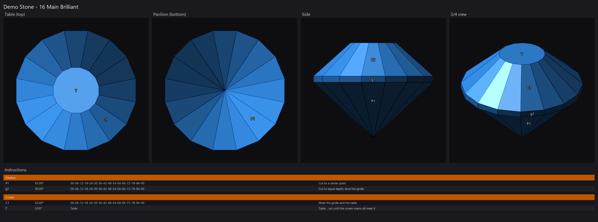
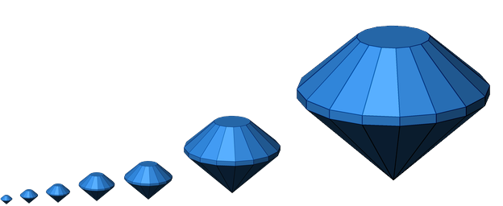

# GCS Viewer

[](https://github.com/loydb/GCSViewer/actions/workflows/tests.yml)
[](https://github.com/loydb/GCSViewer/releases/latest)

Look at a faceted gem design without opening the program that cut it.

**[⬇ Download GCSViewer.exe](https://github.com/loydb/GCSViewer/releases/latest/download/GCSViewer.exe)** —
Windows, nothing to install. Double-click a `.gcs` or `.gem` file and the
stone is on screen: three shaded views and the cutting instructions,
in about a second.



*`docs/demo.gcs`, opened in the viewer. Sixteen pavilion mains, a girdle
band, sixteen crown mains and a table — every meet computed, generated by
[`scripts/make_demo.py`](scripts/make_demo.py).*

## Why

A folder of designs is a folder of files you cannot see. Faceting design
files are geometry, not pictures, so Explorer shows you a name and an icon —
and finding the one stone you are thinking of means launching a design
program and opening candidates one at a time.

This makes them behave like photos instead. Double-click one, arrow through
the folder, close it. It renders, it does not edit, and it never writes to the
file it opened.

## What it shows

Three orthographic, flat-shaded panels, tinted with the material colour
stored in the file:

| Panel | View |
|---|---|
| **Table (top)** | straight down the optic axis |
| **Side** | the girdle profile |
| **3/4 view** | angled, and you can spin it with the mouse |

Below them, the **cutting sequence** — tier, angle, index list and the
instruction the file carries — grouped into Pavilion and Crown, laid out like
the sequence panel in Gem Cut Studio.

The angle, section and index list are **derived from the geometry**, not read
from the file, so they appear for every design including ones that store no
instructions at all. Index positions come from each facet normal against the
gear in the file (96 by default): a facet normal at 22.5° on a 96 gear is
index 06.

Rendering is a painter's algorithm with back-face culling, one fixed light
and a specular highlight — deliberately flat and matte. It is a drawing of the
geometry, not a simulation of the stone: no refraction, no dispersion, no
attempt to look like a photograph. That is the point. Flat shading shows you
the facets, and a meet that does not meet stays visible instead of
disappearing into a sparkle.

## Formats

| | |
|---|---|
| **`.gcs`** | Gemcut Studio XML. Facets, tiers, instructions, material colour. |
| **`.gem`** | GemCad binary — **reverse-engineered**, no published spec. |

The `.gem` reader works out the layout as it goes: records of
`[int32 flag][7-bit-length "tier<TAB>instruction"]` followed by float64
vertex groups, coordinates that are the `.gcs` ones with Y mirrored, and a
trailing block of .NET length-prefixed strings holding the title and the
designer's notes. Face normals are recomputed with Newell's method and
oriented outward, because the stored ones cannot be relied on.

There is no `.asc` support, by design.

## Controls

| Key | Does |
|---|---|
| **← →** | previous / next design in the same folder, wrapping, in Explorer's sort order |
| **drag** | spin the 3/4 view |
| **↑ ↓** | tilt the 3/4 view |
| **I** | show / hide the instructions table |
| **G** | grayscale |
| **L** | tier labels |
| **S** | save the sheet as a PNG next to the design |
| **R** | reset the 3/4 angle |
| **Esc** / **Q** | close |

Unreadable files are skipped while arrowing through a folder rather than
stopping the walk.

## Install

`GCSViewer.exe` needs nothing installed — no Python, no numpy, no Pillow. The
interpreter and every library are inside the executable.

1. Put it somewhere permanent, e.g. `C:\Tools\GCSViewer\`.
2. Register it, from that folder:

   ```powershell
   powershell -ExecutionPolicy Bypass -File .\Install-GcsViewer.ps1
   ```

3. Then **pick it once**: right-click a `.gcs` file → **Open with** →
   **Choose another app** → **GCS Viewer** → tick **Always**. Repeat once for
   `.gem` if you have those too.

Step 2 also registers the document icon, so `.gcs` and `.gem` files stop
showing Explorer's blank page and show a gem instead.

Step 3 is manual because Windows will not let a program make itself the
default handler for a file type. The authoritative setting lives in
`HKCU\...\Explorer\FileExts\<ext>\UserChoice`, which carries a hash and a deny
ACE so that only the shell can write it. Anything claiming to set a default
association silently is either forging that hash or not actually working.
Step 2 does everything a program legitimately can — the ProgId, the
`Applications` entry, `SupportedTypes`, the Open-With MRU and a Start Menu
shortcut, all per-user, no admin — which is what makes "GCS Viewer" appear in
that dialog for you to choose.

[`INSTALL.md`](INSTALL.md) is the version to hand to somebody else, with the
Windows 11 dialog quirks spelled out.

To update, drop the new `GCSViewer.exe` over the old one. The association
points at the path, so the name and location are what matter.

## Run from source

```bash
pip install -r requirements.txt
```

```bash
pythonw gcs_viewer.py "stone.gcs"              # the window
python  gcs_viewer.py "stone.gcs" --save       # just write stone_views.png
python  gcs_viewer.py "stone.gcs" --save out.png --gray --no-labels
python  gcs_viewer.py --selftest report.txt    # prove a build works
```

numpy, Pillow and tkinter, and nothing else — no matplotlib, no scipy.
Developed on Python 3.12; CI runs the suite on 3.10, 3.12 and 3.13, on both
Windows and Linux.

Set `GCS_VIEWER_NO_GUI=1` to make errors print to stderr instead of opening a
message box, so an unattended script cannot stall on a dialog nobody is there
to dismiss.

## Build the exe

```bash
python scripts/build_exe.py --clean
```

Produces `dist/GCSViewer.exe` (~30 MB, single file, no console window) and
copies it over `GCSViewer.exe` at the repo root — same name, same path, so
the file association survives the rebuild. `--onedir` builds a folder instead,
which avoids the `%TEMP%` unpack that `--onefile` performs on every launch and
works where policy makes `%TEMP%` non-executable.

An unsigned executable downloaded from the internet trips Windows SmartScreen
until it earns reputation: expect **More info → Run anyway** once.

Two related tools live in `scripts/`:

```bash
python scripts/compare_exe_source.py GCSViewer.exe gcs_viewer.py
```

An exe carries its entry script as a marshalled code object, so there is no
source inside to diff — but every function's signature, docstring, constants
and compiled bytecode can be compared exactly. This answers the question that
actually matters after an edit: *is the shipped exe still this source?* It is
how the stale 2026-06 build in this project's history was pinned down to the
three changes it was missing.

```bash
python scripts/make_demo.py
python scripts/gen_icon.py
```

`make_demo.py` regenerates `docs/demo.gcs` and `docs/demo.png`.
`gen_icon.py` regenerates `docs/gcsviewer.ico`, which `build_exe.py` compiles
into the executable and the installer points `.gcs` and `.gem` documents at.



The icon is the demo stone, drawn by the viewer's own renderer rather than by
hand, so it cannot drift from what the program produces. Its alpha comes from
a second pass with the lighting flattened to white: keying the colour pass
would have deleted the pavilion, which sits only a few levels above the
background, leaving a crown floating with no stone under it.

## Tests

```bash
python test_gcs_viewer.py     # 124 checks
```

No fixtures on disk and no third-party design files: every stone is
synthesised by the suite, **including the `.gem` binaries**, which are written
by a miniature encoder built from the format notes. A parser tested only
against files it already parses proves nothing about the format; round-tripping
through an independent encoder pins the layout down.

The suite covers both readers, the `write_gcs` round-trip, the tier table, the
camera, shading, back-face culling, paint order and the command line. Two of
those need scenes built specifically to break convexity — a convex stone hides
its own back faces *and* tiles its silhouette without overlap, so on a real gem
you can disable the cull or reverse the depth sort without changing a single
pixel.

That is not a guess. Run:

```bash
python scripts/mutation_check.py
```

It reintroduces thirteen deliberate defects one at a time — dropping the `.gem`
Y mirror, painting nearest-first, ignoring the gear, losing the instruction
text — and reports which checks catch each one. Currently **13 of 13**. The
first run of this harness found three that survived, which is how the culling
and paint-order scenes came to exist.

### Against real files

```bash
python scripts/corpus_scan.py "D:\designs" --render 150 --roundtrip
```

Synthetic stones prove the format; they cannot prove twenty years of files
written by other people's programs. This parses every `.gcs` and `.gem` under
a folder, classifies each one, and — with `--roundtrip` — writes it back out
through `write_gcs` and re-reads it. Rows are appended as they are produced,
so an interrupted run keeps what it learned.

Run over a reference collection of **10,249 designs**, it found four things
the synthetic suite could not, all now fixed:

- **A design whose title is not ASCII would not open at all.** Gem Cut Studio
  writes the file in the machine's code page and declares no encoding, so
  *Viet Gems 216 — Fleur en rêve* was rejected as malformed XML over one byte
  in its title. The reader now falls back through the Windows code pages.
- **Cutting steps were being dropped.** In a `.gem` the instruction belongs to
  the facet that *begins* a step, and a tier can hold several — Alcyone's tier
  `a` is both "Match g1, establish upper girdle line" and "Meet g1.a.a.g1".
  The table read the first facet and stopped: **144 lines lost across 56 of
  the 245 `.gem` files**.
- **`write_gcs` merged tiers that share a name.** Two `<tier>` elements may
  carry the same name, and four designs do; one was rewritten from seven tiers
  to one. Tier boundaries now follow the element, not the label — but only
  where that splits a tier, never where it would merge two.
- **Zero-byte files reported "no element found: line 1, column 0."** Twelve of
  them sit in the collection. They are still unreadable, but now they say so.

What it did not find matters too: across those files there are no other parse
failures, no malformed geometry, and every one of them round-trips through
`write_gcs` with **vertices bit-exact**. Thirteen designs contain facets with
no area, which is a property of those designs rather than a fault in reading
them. A 150-design render sample completed without a failure.

## A note for the solver

`parse_gcs`, `parse_gem`, `write_gcs` and `load_design` are imported by a
separate, unpublished pipeline that reconstructs faceting designs from
scanned diagrams. That makes them a shared surface with a real dependent, so
changes here are additive: new optional parameters, never a changed signature
or a changed meaning. The parser checks in `test_gcs_viewer.py` are the
contract.

## License

MIT — see [LICENSE](LICENSE).

*GCS Viewer is an independent viewer. It is not affiliated with Gemcut Studio,
Gem Cut Studio, GemCad or their authors, and it only ever reads their files.*
